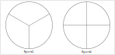

TP turtle
=========
   
Le module Turtle permet de réaliser des figures et des dessins en déplaçant une tortue qui effectue les tracés. On donne ci-dessous les principales fonctionnalités de ce module.

.. csv-table::
   :header: Fonction Turtle, Rôle de la fonction
   :align: center
   :widths: 30, 70
   :delim: -
   :file: ../csv/instruction_turtle.csv

Les dessins sont affichés dans une fenêtre graphique. Cette fenêtre dispose d'un repère avec un axe des abscisses et un axe des ordonnées mais il n'est pas affiché. La position initiale de la tortue est au centre de la fenêtre et ses coordonnées sont (0,0). Elle est orientée vers la droite, parallèlement à l'axe des abscisses.

   
L'objectif de ce TP est de dessiner une roue avec ses rayons. Le dessin est composé d'un cercle et de ses rayons équitablement répartis sur l'ensemble du cercle comme le montre la figure suivante:

Roue avec 3 et 4 rayons
-----------------------

Dans un premier temps, on va réaliser les figures représentées ci-dessous :

#. Créer dans **Thonny** un nouveau fichier nommé ``tp_turtle.py``. Ce fichier peut être enregistré dans votre espace personnel.
#. Pour utiliser le module de dessin turtle, il faut l'importer dans le fichier avec la commande suivante:

   .. code::

      from turtle import *

#. Définir la variable ``rayon`` de type ``int`` dont la valeur initiale est 100.
#. En utilisant les commandes de turtle (ci-dessus), produire un code en Python qui réalise la **figure 1**.
#. Que faut-il modifier dans le code de la figure 1 pour obtenir la **figure 2** ?
#. Faire les modifications et vérifier que la figure 2 est bien dessinée.

Augmenter le nombre de rayons
-----------------------------

La création d'une roue avec un plus grand nombre de rayons ne peut pas être réalisée comme précédemment sans risquer une erreur de saisie ou un oubli. On remarque :

- des instructions se répètent de la même façon;
- que modifier une valeur implique de modifier beaucoup de lignes du code;
- que l'angle varie en fonction du nombre de rayons.
   
Pour améliorer notre code, nous allons utiliser des **boucles** et d'autres **variables**.

#. Le nombre de rayons est mémorisé dans une variable ``n``. Créer la variable ``n`` de type ``int`` égale à 3.
#. Pour éviter la **répétition** des instructions, Python dispose d'une structure dite de **boucle** qui effectue autant de fois que nécessaire des instructions. La boucle ``for`` suit la syntaxe suivante:

   .. code-block :: Python

      for i in range(n):
          # n est le nombre de répétitions
          
          # instructions à répéter
          ...
   
   Modifier le code de votre figure avec l'instruction de boucle ``for``:
   
#. Vérifier que vos roues à 3 et à 4 rayons se dessinent correctement.
#. L'angle de rotation de la tortue dépend du nombre de rayons et se calcule avec le nombre de rayons ``n``.

   a. Comment se calcule la mesure de l'angle en fonction du nombre de rayons.
   b. Créer la variable ``angle`` et lui affecter sa valeur avec le calcul précédent.
   c. Modifier le code en introduisant la variable ``angle``.
   
#. Réaliser différentes figures pour des valeurs de ``n`` égales à 10, 20, 36 et 100.